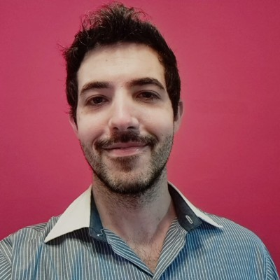

 
  e-mail: lksleiva@gmail.com 
    mobile: +54 1131839193   Location: Buenos Aires, Argentina
    [Linkedin:](https://www.linkedin.com/in/lucas-leiva-71907634)
    [Portfolio:](https://lucasleivaportfolio.wordpress.com)

# Lucas Leiva  

## Professional Summary

Analytical development engineer, well-versed in Multimedia, OTT streaming and DTV broadcasting architecture, solution development and deployment support. Valuable in review of proposals, making effective choices and contributing to entire development lifecycle. Excellent communication, planning and decision-making skills.

## Skills:
*	SW development. I had worked with the following languages:
	JavaScript / Typescript / React / React Native; Python; C / C++ / C# (Unity); MATLAB; Java; Assembler
*	Image/video/audio processing & analyses
*	Streaming protocols (MPEG-DASH, HLS, CMAF, RTMP, ZIXI, SRT, UDP, etc.)
*	Communication protocols (TCP/IP, HTTP, SNMP, etc.)
*	Multimedia Codecs/containers/protocols (MPEG2, MPEG2-TS, SDI, H.264, HEVC, mp4, AAC, etc.)
*	3Dof/6DoF (360 Video, 3D, OMAF, spatial audio, Volumetric video, VPCC glTF, Object-Base Audio, etc.)
*	Digital TV systems (DVB, ATSC, ISDB-T / IP TV / ABR /DRMs / CDNs, etc)
*	Telecommunications (RF, QAM, OFDM, etc.)
*	AI (Computer Vision, Neural Networks, CNNs, Reinforcement Learning, SVM, etc.)
*	Cloud Computing
*	WEB 3 (Blockchain, Smart contracts, NFTs, IPFS, etc.)
*	Spatial Computing / XR (AR/VR/MR) / Metaverse
* Soft Skills (problem-solving, creative,teamworking, communication, conceptual thinking, decision-making) 
*	Agile (Scrum, Kanban, Jira, Trello)

## WORK HISTORY

#### Telecom Argentina - Senior Tech Architect (11/2021 - present) 
*	R&D about different topics including XR (AR/VR/MR), Metaverse and Computer Vision.
*	Improvements, PoC design, and problem-solving of Multimedia Solutions on-premises and Cloud.
*	Improvements on security of OTT Live streaming service to mitigate piracy.
*	Analyses of metrics and measurement processes for QoE of live video (e.g., PSNR, VMAF, etc.).
*	TCO analyses for the evolution of Multimedia Head End Technology (OTT and Broadcast). 

#### Telcom Ventures De Argentina – Broadcast & Media Engineer (2016/11 - 11/2021) 

*	Set Top Boxes Homologation: Elaboration of RFPs, testing, debugging and coworking on the development and improvement of the product.
*	Operation, testing and evaluation of TV equipment such as encoders, multiplexers, transmitters, filters, receivers, etc
* Management and design of NMS System for equipment monitoring and automation.
*	Research and analysis of improvements in digital television system

#### Network Broadcast - QA Engineer (12/2015 - 11/2016)

*	Test of Set Top Boxes for Digital TV, mainly for DVB standard.
*	Continue communication with international suppliers to define, adapt and improve products.
*	In house co-development and customizations of software for STBs
*	Research and development in new areas of digital TV such as OTT, IPTV, etc.

#### MEGATECH - Repair Specialist (04/2015 - 08/2015)

*	Repair of computer equipment such as notebooks, ultrabooks, tablets and AIOs.

#### INTEL - Tech Intern (01/2013 - 01/2014)
*	Assembly of demos on new technologies, technical support, Inventory Management.

#### DESING XXI - Electronics Technician (01/2009 - 01/2013)
*	Development, assembly and commissioning of devices for quality control and industrial automation (Hardware and Software), PLC programming.

#### ELYTEL S.R.L - HW PCB Designer (01/2007 - 01/2008)
*	PCB design and assembly, circuit testing, repairs, etc.

## ACCOMPLISHMENTS
* Co-Inventor of Granometer-Automatic grain counter 2021. Patent registration application of Shared Utility Model UBA-CONICET-UTN. 
* XX Argentine Congress of Bioengineering SABI 2015 -San Nicolás de los Arroyos. Work presented: “Analysis of the transit time of the arterial pulse by tonometry:
application in the university community.” Leiva L., Schiaffi J., Alfonso M., Cymberknop
L.J., Armentano R. L. 
* Scholarship in Bioengineering Research Group (GIBIO), dependent on the Science and Technology Secretariat of the UTN FRBA -2015-2017.
  
<!--  
## Projects: 
* [Casual-Markdown](https://github.com/casualwriter/powerpage) - a lightweight markdown parser
* [Powerpage](https://github.com/casualwriter/powerpage) - a lightweight browser for html applications
-->

## Education & Qualifications

* AWS Certification (2021/12)
* Oracle Certified Professional (2020/02)
* Project Management Professional (PMP) (2018/10)
* Bachelor of Computer Science (Sep 2004)
* The Chinese University of Hong Kong (2000 - 2004)

## Languages
* English (B2 Upper-intermediate)
* Spanish (native)
