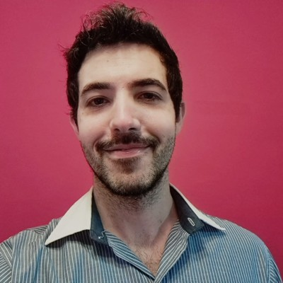

 
  e-mail: lksleiva@gmail.com  
    móvil: +54 1131839193  
    Ubicación: Buenos Aires, Argentina  
    [LinkedIn:](https://www.linkedin.com/in/lucas-leiva-71907634)  
    [Portafolio:](https://lucasleivaportfolio.wordpress.com)  

# Lucas Leiva  

## Perfil Profesional

Ingeniero de desarrollo analítico con sólida experiencia en multimedia, transmisión OTT y arquitectura de radiodifusión DTV, desarrollo de soluciones y soporte en su implementación. Valioso en la revisión de propuestas, toma de decisiones efectivas y contribución en todo el ciclo de vida del desarrollo.  
Excelentes habilidades de comunicación, planificación y toma de decisiones.

## Habilidades

* Desarrollo de software en:  
  JavaScript / Typescript / React / React Native; Python; C / C++ / C# (Unity); MATLAB; Java; Assembler  
* Procesamiento y análisis de imágenes/video/audio  
* Protocolos de streaming (MPEG-DASH, HLS, CMAF, RTMP, ZIXI, SRT, UDP, etc.)  
* Protocolos de comunicación (TCP/IP, HTTP, SNMP, etc.)  
* Codecs, contenedores y protocolos multimedia (MPEG2, MPEG2-TS, SDI, H.264, HEVC, mp4, AAC, etc.)  
* 3DoF/6DoF (Video 360, 3D, OMAF, audio espacial, video volumétrico, VPCC glTF, Audio Basado en Objetos, etc.)  
* Sistemas de TV digital (DVB, ATSC, ISDB-T / IP TV / ABR / DRMs / CDNs, etc.)  
* Telecomunicaciones (RF, QAM, OFDM, etc.)  
* Inteligencia Artificial (visión computacional, redes neuronales, CNNs, aprendizaje por refuerzo, SVM, etc.)  
* Computación en la nube  
* Web 3 (Blockchain, contratos inteligentes, NFTs, IPFS, etc.)  
* Computación Espacial / XR (AR/VR/MR) / Metaverso  
* Habilidades blandas (resolución de problemas, creatividad, trabajo en equipo, comunicación, pensamiento conceptual, toma de decisiones)  
* Metodologías ágiles (Scrum, Kanban, Jira, Trello)

## Experiencia Laboral

#### Telecom Argentina – Arquitecto Técnico Senior (11/2021 - presente)  
* I+D en temas como XR (AR/VR/MR), Metaverso, Visión Computacional, Selectores de CDN, etc.  
* Diseño de PoC, mejoras y resolución de problemas en soluciones multimedia en local y en la nube.  
* Mejoras en la seguridad del servicio OTT Live streaming para mitigar la piratería.  
* Análisis de métricas y procesos de medición de QoE de video en vivo (PSNR, VMAF, etc.)  
* Análisis TCO para evolución de Head End multimedia y tecnología CDN (OTT y Broadcast)

#### Telcom Ventures De Argentina – Ingeniero Broadcast & Media (11/2016 - 11/2021)  
* Homologación de STBs: elaboración de RFPs, pruebas, depuración y colaboración en el desarrollo/mejora del producto  
* Operación, prueba y evaluación de equipos de TV como codificadores, multiplexores, transmisores, filtros, receptores, etc.  
* Gestión y diseño de sistemas NMS para monitoreo y automatización  
* Investigación y análisis de mejoras en sistemas de televisión digital

#### Network Broadcast – Ingeniero QA (12/2015 - 11/2016)  
* Pruebas de STBs para TV Digital, principalmente estándar DVB  
* Comunicación con proveedores internacionales para definir, adaptar y mejorar productos  
* Co-desarrollo y personalización de software para STBs  
* Investigación y desarrollo en OTT, IPTV y nuevas áreas de TV Digital

#### MEGATECH – Especialista en Reparación (04/2015 - 08/2015)  
* Reparación de equipos informáticos como notebooks, ultrabooks, tablets y AIOs

#### INTEL – Pasante Técnico (01/2013 - 01/2014)  
* Armado de demostraciones tecnológicas, soporte técnico y gestión de inventario

#### DESING XXI – Técnico Electrónico (01/2009 - 01/2013)  
* Desarrollo, montaje y puesta en marcha de dispositivos para control de calidad y automatización industrial (hardware y software), programación de PLC

#### ELYTEL S.R.L – Diseñador HW de PCBs (01/2007 - 01/2008)  
* Diseño de PCBs, montaje, pruebas de circuitos, reparaciones, etc.

## Logros

* Co-inventor del “Granómetro - contador automático de granos” (2021). Registro de patente bajo Modelo de Utilidad Compartida UBA-CONICET-UTN  
* Congreso Argentino de Bioingeniería XX SABI 2015 – Trabajo presentado: “Análisis del tiempo de tránsito del pulso arterial por tonometría: aplicación en comunidad universitaria.”  
* Becario en Grupo de Investigación en Bioingeniería (GIBIO), dependiente de la Secretaría de Ciencia y Tecnología de UTN FRBA (2015-2017)

## Educación y Certificaciones

* U.T.N. Facultad Regional Buenos Aires (2009/22) - Bs. As., Argentina
	* Título: Ingeniero electrónico
 	* Becario en Grupo de Investigación en Bioingeniería (GIBIO), dependiente de la Secretaría de
Ciencia y Tecnología de la UTN FRBA -2015-2017 http://gibio.frba.utn.edu.ar/
* E.T. N°1 Otto Krausel (02/2008)  - Bs. As., Argentina  
	* Título: Técnico electrónico
* Instituto Cambridge 2004-2008 - Bs. As., Argentina
	* Título: Sexto año – Nivel Superior Instituto
## Idiomas

* Inglés (B2 intermedio superior)  
* Español (nativo)

